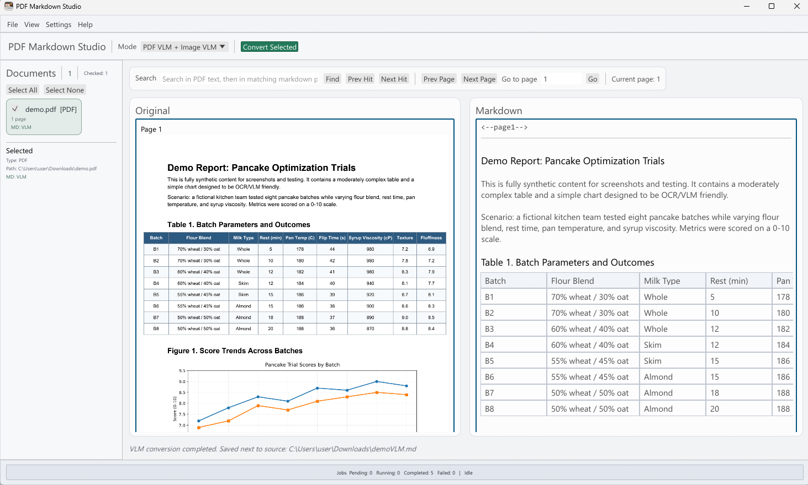

# PDF Markdown Studio



PDF Markdown Studio is a desktop app for converting PDFs and images into clean Markdown.

It is built as an **example integration client** for OpenResearchTools Engine, showing how to run Engine PDF and VLM workflows from a GUI.

The PDF Markdown Studio application source code is licensed under the MIT License; third-party dependencies and bundled components remain licensed under their respective original licenses.

## What You Can Do

- Add multiple files (PDFs and images) into one workspace.
- Preview the source document and generated Markdown side-by-side.
- Search by text and jump through matching pages.
- Convert selected files using either fast PDF extraction or VLM-based extraction.
- Edit Markdown in place and save changes.

## Supported Files

- PDF (`.pdf`)
- Images (`.png`, `.jpg`, `.jpeg`, `.bmp`, `.gif`, `.webp`, `.tif`, `.tiff`)

## Conversion Modes (How To Choose)

### 1) FAST PDF

Use this for machine-readable digital PDFs.

- Very fast.
- Best when text is selectable in the PDF.
- Output quality is strong for standard digital documents.
- Limitation: table content is often flattened/inline in output; complex tables can become misstructured.

### 2) PDF VLM + Image VLM

Use this when layout is complex, scanned-like, visual-heavy, or FAST output is poor.

- Uses your selected VLM model + MMProj.
- Works for both PDFs and images.
- Slower than FAST, but better for difficult pages.
- Limitation: table quality depends on the selected model's capabilities.
- On complex tables with heavy formatting/whitespace, models can misattribute values to wrong cells or rows.
- If downstream automation depends on table values, compare Markdown against the original document before automated extraction.

### 3) FAST PDF + VLM fallback

Try FAST first, then automatically switch to VLM if FAST identifies non-machine-readable content.

- Good default when PDF quality is mixed.
- Balances speed and robustness.

## Quick Start

1. Open the app.
2. In `Settings`, make sure runtime is healthy and model paths are set.
3. Click `File`, `Add PDFs / Images`.
4. Tick files in the Documents sidebar.
5. Select a conversion mode.
6. Click `Convert Selected`.

Output files are written next to the source document:

- `filenameFAST.md`
- `filenameVLM.md`

## Viewing and Navigation

- Left pane: original PDF/image.
- Right pane: Markdown preview/edit.
- `Find`, `Prev/Next Hit`, and page controls are above the workspace.
- View zoom affects both panes together.

## Runtime and Model Location

Default runtime path:

- `C:\Users\<user>\AppData\Roaming\OpenResearchTools\engine`

Default app settings/data path:

- `C:\Users\<user>\AppData\Roaming\OpenResearchTools\PDF Markdown Studio`

Default vision model folder:

- `C:\Users\<user>\AppData\Roaming\OpenResearchTools\Models\Vision`

## GPU / CPU Execution

- CPU mode: run without GPU acceleration.
- GPU mode: select one GPU in settings.
- The app sends one selected GPU for VLM execution paths through Engine runtime.

# Troubleshooting
## Unsigned Build Notice

This app is an open-source hobby development effort by the repository owner.
We do not currently have funding for full paid code-signing and notarization
pipelines across all platforms/releases.

Because of that, operating-system protections or hardened security environments
(for example Windows SmartScreen, enterprise endpoint controls, or macOS
Gatekeeper policies) may block unsigned binaries.

If your environment blocks unsigned binaries, the recommended path is:
- build this desktop app from source on the target device,
- build Openresearchtools-Engine from source on the same target device,
- and use those locally-built artifacts in your deployment.

### Windows (when blocked)

- If SmartScreen shows "Windows protected your PC", use `More info` ->
  `Run anyway` only if your policy allows it.
- In the app, go to `Settings -> Runtime Setup` and run:
  - `Download/Repair runtime`
  - `Unblock unsigned runtime`
  - `Recheck`
- The Windows unblock script clears Mark-of-the-Web flags in the selected
  runtime directory by running `Unblock-File` recursively on runtime files.

### macOS (when blocked)

- Try `Right click -> Open` on first launch.
- If blocked by Gatekeeper, use `System Settings -> Privacy & Security ->
  Open Anyway` when available and policy permits.
- In the app, after runtime install/repair, click `Unblock unsigned runtime`
  then `Recheck`.
- The macOS unblock script removes quarantine attributes recursively
  (`xattr -dr com.apple.quarantine`) and restores executable bits for runtime
  binaries/scripts where needed (`chmod +x` on relevant files).

##If conversion fails or setup is incomplete:

1. Open `Settings`.
2. Use runtime health/check and download/repair actions.
3. Confirm model and MMProj paths exist.
4. Check `Jobs and logs` for the exact error.

##If adding many files feels slow:

- Wait for background imports to finish before converting.
- Large PDFs can take time to rasterize and preview.

## Acknowledgements (What This App Uses)

This app uses OpenResearchTools Engine runtime components for PDF and VLM execution `https://github.com/openresearchtools/engine`. For this app's active feature set, key upstream technologies include:

- [`Openresearchtools-Engine`](https://github.com/openresearchtools/engine):
  embeddable runtime used by this app (`llama-server-bridge`, runtime orchestration, and model/device execution path).
- [`egui`](https://github.com/emilk/egui) / [`eframe`](https://github.com/emilk/egui/tree/master/crates/eframe):
  native immediate-mode GUI framework used to build this desktop application UI.
- [`llama.cpp`](https://github.com/ggml-org/llama.cpp) and [`ggml`](https://github.com/ggml-org/ggml):
  core inference runtime and device/offload mechanics used through Openresearchtools-Engine.
- [`Docling`](https://github.com/docling-project/docling):
  reference logic for VLM document-conversion behavior used by Engine `pdfvlm`, including page-wise rendering/scaling heuristics (`scale`, `oversample`) and Catmull-Rom style downscale before inference.
- [`PDFium`](https://pdfium.googlesource.com/pdfium/) and [`pdfium-render`](https://github.com/ajrcarey/pdfium-render):
  PDF rasterization/page access primitives used by the app's native PDF rendering and by Engine PDF conversion paths.
- [`Qwen`](https://huggingface.co/Qwen) / [`Qwen3-VL GGUF`](https://huggingface.co/Qwen/Qwen3-VL-8B-Instruct-GGUF):
  VLM model family used for image and PDF-VLM markdown conversion when configured by the user.

This project is independent and is **not affiliated with, sponsored by, or endorsed by** `egui`, `llama.cpp`, `Docling`, `PDFium`, `Qwen`, or other upstream projects/vendors.


## How to cite

Suggested citation:

Rutkauskas, L. (2026). *PDF Markdown Studio* (Version 1.0.0) [Computer software].
OpenResearchTools. <https://github.com/openresearchtools/pdfmarkdownstudio>.

BibTeX:

```bibtex
@software{Rutkauskas_PDFMarkdownStudio_2026,
  author    = {Rutkauskas, L.},
  title     = {PDF Markdown Studio},
  version   = {1.0.0},
  date      = {2026-03-04},
  url       = {https://github.com/openresearchtools/pdfmarkdownstudio},
  publisher = {OpenResearchTools},
  license   = {MIT}
}
```

